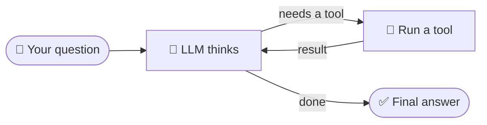
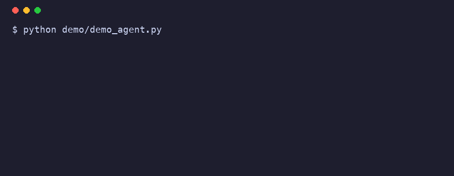
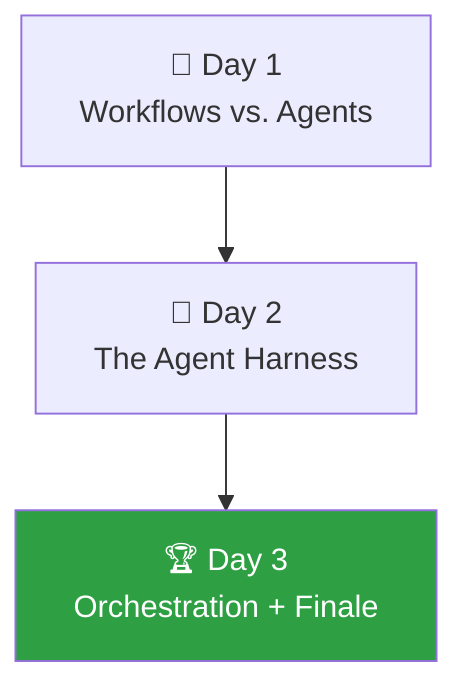

<div align="center">

# 🤖 Agents Bootcamp

**Assignments & Harness**

Build your first AI agents, step by step, in LangGraph and LangSmith.

    

</div>

---

Welcome! 👋 This repo contains everything you need for the **Agents Bootcamp**: the
assignments for all three days, plus a ready-made *harness* (shared helper code and
tools) so you can focus on the interesting part, building agents, instead of
plumbing.

> **The one idea behind the whole week:** an agent is just an LLM in a loop with
> tools and a goal.



Everything else you learn this week (memory, skills, orchestration) is a
refinement of that loop.

## See it in action 🎬

That loop, running in the terminal:

<div align="center">



</div>

The finished demo agent lives in [`demo/`](demo/). To regenerate the GIF you
only need Pillow (no system tools like `vhs` or `ffmpeg`):

```bash
pip install pillow
python demo/record_demo.py
```

## What you already know

You've completed the first sprint of the starter program, and this week builds
straight on top of it:

| Earlier session | What you learned there | How we build on it |
|---|---|---|
| LLM Fundamentals | Tokens, context windows, your first API call | Every agent is "just" LLM calls in a loop |
| Prompt & Context Engineering | System prompts, the message paradigm, RAG | Agents live or die by their context |
| Observability & Evaluation | LangSmith traces, LLM-as-a-judge | You'll trace every agent you build this week |

## The week at a glance 🗺️



| Day | Goal | Morning assignment | Afternoon assignment |
|---|---|---|---|
| **Day 1** | Understand workflows vs. agents | [Build your first workflow](day-1/assignment-1-workflow/) | [Build your first tool-calling agent](day-1/assignment-2-first-agent/) |
| **Day 2** | Understand the agent harness | [Extend your agent: tools & memory](day-2/assignment-1-extended-agent/) | [An agent that browses & reads skills](day-2/assignment-2-skills-agent/) |
| **Day 3** | Understand orchestration | [🏆 Build the Ultimate Agent](day-3/final-assignment-ultimate-agent/) (groups, all day, **prizes!**) | none |

Every assignment ends with a short **show & tell**: you present your approach in a
few minutes and we discuss the different solutions. There is never one "right"
answer; the discussion is where the learning happens.

## Setup ⚙️

> Do this before Day 1. It takes about 10 minutes. You need **Python 3.10 or
> newer** (`python3 --version` to check).

```bash
# 1. Clone this repo and move into it
git clone <repo-url>
cd agents-bootcamp-assessments

# 2. Create a virtual environment (an isolated box for this project's packages)
python3 -m venv .venv
source .venv/bin/activate        # Windows: .venv\Scripts\activate

# 3. Install the harness + all dependencies
#    The "-e" means "editable": Python always uses the live code in this folder.
pip install -e .

# 4. Create your personal .env file and fill in the keys you received
cp .env.example .env
#    ... now open .env in your editor and paste your keys ...

# 5. Verify that everything works
python check_setup.py
```

If `check_setup.py` prints all green checkmarks, you're ready. If not, it tells
you exactly what to fix.

## What's in this repo? 📂

<details>
<summary><b>Click to expand the folder tree</b></summary>

```
agents-bootcamp-assessments/
├── harness/                  ← Shared helper code (already built for you)
│   ├── llm.py                ← get_llm(): a configured chat model in one line
│   ├── data.py               ← Mock webshop data (products, orders, FAQ)
│   └── tools/                ← Ready-made tools your agents can use
├── day-1/
│   ├── assignment-1-workflow/       ← Morning: a fixed-steps LLM workflow
│   └── assignment-2-first-agent/    ← Afternoon: your first real agent
├── day-2/
│   ├── assignment-1-extended-agent/ ← Morning: more tools + memory
│   └── assignment-2-skills-agent/   ← Afternoon: browsing + skills
├── day-3/
│   └── final-assignment-ultimate-agent/  ← The grand finale (group work)
├── check_setup.py            ← Run this once to verify your setup
└── .env.example              ← Template for your API keys
```

</details>

Each assignment folder has its **own README** with the full instructions, and a
**starter file** full of comments that walk you through the code. Look for:

- `# TODO(you):` marks the places where *you* write code
- `✅ CHECKPOINT` marks moments to stop and verify things work before moving on
- `🚀 STRETCH GOALS`: finished early? These take it further

## The harness 🧰

The harness is everything already built for you, so you never start from a blank file.

**One-line LLM access**, instead of configuring a model in every file:

```python
from harness import get_llm

llm = get_llm()                    # uses BOOTCAMP_MODEL from your .env
response = llm.invoke("Hello!")    # a normal LLM call, like in week 1
```

> ℹ️ **We don't call OpenAI directly.** `get_llm()` routes every call through
> Coolblue's **AI Service Router** (an OpenAI-compatible endpoint with
> failover, shared quota and central auth, run by the Virtual Agents Platform
> team). You don't have to think about it (it's the same LLM interface), but
> it's why your `.env` has `AI_SERVICE_ROUTER_*` variables instead of a raw
> OpenAI key. Curious how it's wired? Read
> [`harness/llm.py`](harness/llm.py); it's about 15 lines.

**Ready-made tools** are small Python functions your agents can decide to call.
They run on mock data, so no external accounts are needed and nothing can break:

| Tool | What it does | Used from |
|---|---|---|
| 🌤️ `get_weather(city)` | Fake-but-consistent weather report | Day 1 |
| 🧮 `calculator(expression)` | Safely evaluates math like `"512 * 1.21"` | Day 1 |
| 🔎 `search_products(query)` | Searches the mock webshop catalog | Days 1 to 3 |
| 📦 `get_product_details(product_id)` | Full specs, price and stock for one product | Days 2 to 3 |
| 🚚 `get_order_status(order_id)` | Looks up a customer order | Days 2 to 3 |
| 📖 `search_faq(question)` | Searches store policies (returns, delivery, warranty) | Days 2 to 3 |
| 📔 `save_note(note)` / `read_notes()` | Simple long-term memory on disk | Day 2 |
| 🧩 `list_skills()` / `read_skill(name)` | Discover and load "skill" instruction files | Day 2 |
| 🌐 `fetch_webpage(url)` | Downloads a webpage as readable text | Days 2 to 3 |

Import them like this:

```python
from harness.tools import get_weather, calculator, search_products
```

You are encouraged to **read the harness source code**. Every tool is short,
heavily commented, and shows you how to write your own.

## LangSmith: your X-ray glasses 🔍

Because your `.env` sets `LANGSMITH_TRACING=true`, every run automatically
appears at [smith.langchain.com](https://smith.langchain.com) under your project
name. When (not if!) your agent does something weird:

1. Open your project in LangSmith
2. Click the most recent trace
3. Walk through every step: what did the LLM see? Which tool did it pick? Why?

Debugging agents by staring at your code is hard. Debugging them by reading the
trace is easy. Make it a habit from assignment 1.

## Troubleshooting 🩺

<details>
<summary><b>Common problems and their fixes</b></summary>

| Symptom | Fix |
|---|---|
| `ModuleNotFoundError: No module named 'harness'` | Run `pip install -e .` from the repo root, with your venv activated |
| `401 Invalid client` | Your `AI_SERVICE_ROUTER_CLIENT` in `.env` doesn't match a registered clientName, so ask the trainers |
| `AuthenticationError` / 401 | Your `AI_SERVICE_ROUTER_API_KEY` in `.env` is missing or has a typo |
| Connection / timeout errors | You may need to be on the Coolblue network/VPN to reach the router |
| No traces in LangSmith | Check `LANGSMITH_TRACING=true` and your `LANGSMITH_API_KEY` in `.env` |
| `.env` changes not picked up | Restart your Python process, since the file is read at startup |

</details>

## Useful documentation 📚

- [LangGraph concepts](https://docs.langchain.com/oss/python/langgraph/overview): graphs, state, nodes, edges
- [LangChain agents](https://docs.langchain.com/oss/python/langchain/agents): `create_agent` and friends
- [Tools](https://docs.langchain.com/oss/python/langchain/tools): writing your own `@tool`
- [LangSmith](https://docs.langchain.com/langsmith/home): tracing and evaluation
