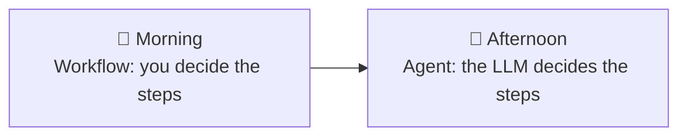

# Day 1: Workflows vs. Agents

  

**Goal of the day:** understand the difference between a *workflow* and an
*agent*, and build one of each.

| Part | Assignment | What you build |
|---|---|---|
| Morning | [Assignment 1: Build your first workflow](assignment-1-workflow/) | A fixed-steps LLM pipeline in LangGraph |
| Afternoon | [Assignment 2: Build your first agent](assignment-2-first-agent/) | A tool-calling agent that decides its own steps |

## The core idea of today

- **Workflow** = *you* decide the steps, the LLM fills them in.
  Step 1 → Step 2 → Step 3, every single time. Predictable, testable, cheap.
- **Agent** = the *LLM* decides the steps. You give it tools and a goal;
  it loops (think → call tool → look at result → think again) until done.
  It is flexible and powerful, and harder to predict.

Neither is "better". Choosing the right one for the job is the actual skill,
and it's what we'll debate during the show & tell after each assignment.

## Show & tell

At the end of each assignment, a few people walk the group through their
solution (5 minutes, straight from your screen, no slides). Questions we'll
discuss:

- Where did you let the LLM decide, and where did you decide in code?
- What did you see in your LangSmith traces that surprised you?
- What would break first if real customers used this?
