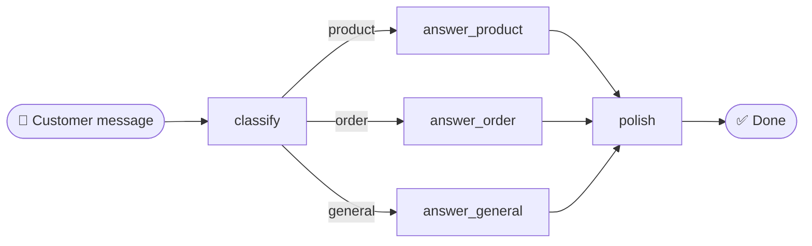

# Day 1 · Assignment 1: Build your first workflow

   

## What you'll build

A **customer message workflow** for our mock webshop. The graph is already
built and wired, so **you only write the prompts**. This keeps today about the
one idea that matters: in a workflow, *you* decide the steps.



1. **classify** labels the message: *product*, *order*, or *general*.
2. **answer_...** is three specialised prompts, one per type of message.
3. **polish** rewrites the draft in a friendly, consistent tone of voice.

This is a **workflow**: the steps and their order are fixed by you, in code.
The LLM never chooses what happens next; it only fills in each step. This
afternoon you'll build an *agent* and feel the difference.

## Your job: write 3 prompts

Open [`workflow.py`](workflow.py). Everything runs already, but the prompts
are blank. Fill in the three `TODO(you)` markers:

1. **TODO 1, the classify prompt.** Make the model answer with exactly one
   word: `product`, `order` or `general`.
2. **TODO 2, the order-answer prompt.** Write it yourself. Two other answer
   prompts (`answer_product`, `answer_general`) are already written as
   **worked examples**, so copy their style.
3. **TODO 3, the polish prompt.** Rewrite the draft into CoolShop's tone of
   voice.

Run it after each change:

```bash
cd day-1/assignment-1-workflow
python workflow.py
```

✅ **CHECKPOINT:** all three test messages get a sensible, friendly answer,
and each one is classified into the right category.

## Look at your traces! 🔍

Open [eu.smith.langchain.com](https://eu.smith.langchain.com) → your project. Each
run shows the full path through the graph: which nodes ran, what prompt each
one sent, what the LLM replied. Did the classifier ever pick the wrong
category? What happened downstream when it did?

## 🚀 Stretch goals (optional, pick any)

- **Add a 4th category** `complaint`, with its own empathetic prompt. (You'll
  need to add one line to the classify prompt and one node, so peek at how
  `answer_general` is wired.)
- **Make classify return urgency too** and mention it in the final answer.
- **Break it on purpose:** what message confuses the classifier? Why?

## Questions for the show & tell

- Was one word enough to get a reliable classification, or did you have to be
  very explicit in the prompt?
- Where would this workflow break with real customers? What input would fool it?
- When would you pick this fixed workflow over the agent you build this afternoon?
