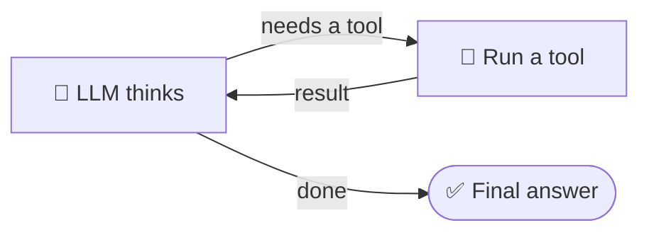

# Day 1 · Assignment 2: Build your first agent

   

## What you'll build

This morning *you* decided the steps. Now you hand that control to the LLM.
An **agent** is an LLM in a loop with tools and a goal:



That loop **is** the agent. `create_agent()` builds it for you, so you build
the agent in two small steps:

- **Part A, the prompt.** A tool is already wired up. You *only* write the
  system prompt, then watch the agent decide to use the tool.
- **Part B, your own tool.** You write a brand-new tool from scratch and
  hand it to the agent.

## Part A: write the system prompt (~25 min)

Open [`agent.py`](agent.py). Two tools (`get_weather` and `calculator`) are
already wired in, so you don't touch any of that. Just fill in **`SYSTEM_PROMPT`**
(the `TODO(you) PART A` marker), then run it:

```bash
cd day-1/assignment-2-first-agent
python agent.py
```

The test question, *"What's the weather in Rotterdam, and what is 17.5% of
2840?"*, needs **both** tools.

✅ **CHECKPOINT:** open the LangSmith trace and find:

1. the moment the agent decided to call `get_weather` (look at the arguments
   it passed. Where did they come from?)
2. the tool result coming back as a **tool message** (remember the message
   paradigm from the prompt-engineering day; this is that 4th role!)
3. the second loop where it calls `calculator`.

Now experiment: change your prompt to say *"never use tools, just answer from
memory"* and re-run. Does the math go wrong? That is *why* agents use tools.

## Part B: add your own tool (~40 min)

Tools are just Python functions. In [`agent.py`](agent.py) you'll find:

- ✅ a **worked example** tool, `count_words`, fully written. Read it line by
  line to see the `@tool` pattern.
- a **blank space** with a spec: write a tool that **converts euros to US
  dollars** (use a fixed rate of 1 EUR = 1.08 USD).

Write your tool from scratch, copying the shape of the example. Then add both
`count_words` **and** your new tool to the `TOOLS` list, and change the test
`QUESTION` to something that needs them, e.g.:

> *"How many words are in 'the quick brown fox', and how much is 250 euros in
> dollars?"*

✅ **CHECKPOINT:** the trace shows the agent calling *your* tool with the
right arguments, and the final answer uses the result.

💡 The **docstring is your tool's advertisement** to the model. Try making it
vague ("does a thing") and watch the agent stop using it. Clear descriptions
are the single biggest lever on tool use, and this is the whole lesson.

## 🚀 Stretch goals

- **A tool with two arguments**, e.g. `convert_currency(amount, rate)`, so
  the agent has to figure out both from the question.
- **A tool that can fail:** return a helpful error string for bad input
  (like the harness `calculator` does) and see how the agent recovers.
- **Break it on purpose:** ask for something none of your tools can do. Does
  the agent admit it, or invent an answer? Tie this back to your prompt.

## Questions for the show & tell

- Workflow (this morning) vs. agent (now): which was easier to build? Which is
  easier to *trust*?
- What did your agent do when it lacked the right tool for the job?
- Which wording in your tool's docstring made the agent actually use it?
