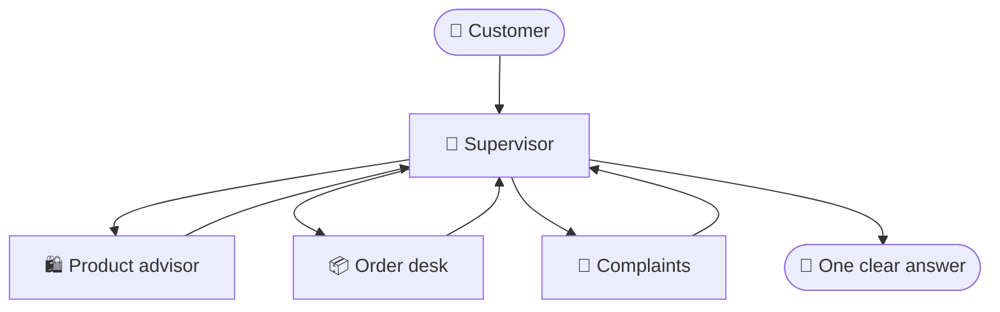

# Day 3: Agent Orchestration & The Grand Finale

  

**Goal of the day:** understand agent *orchestration*, meaning how multiple
agents work together, and prove it by building the Ultimate Agent in teams.

| Part | What happens |
|---|---|
| Morning theory | Orchestration patterns: supervisor, handoffs, subgraphs, agents-as-tools |
| Morning + afternoon | [🏆 Final assignment: Build the Ultimate Agent](final-assignment-ultimate-agent/), in teams |
| End of day | Demos, jury deliberation, **prize ceremony** 🎉 |

## Why orchestration?

By now you've seen it yourself: one agent with ten tools starts making
mistakes. Its context fills up, tool choice gets sloppy, prompts fight each
other. The fix mirrors how companies work: **specialists plus coordination**.

Patterns you can choose from today (mix freely):

- **Supervisor:** one coordinator agent delegates to specialist agents and
  assembles the final answer. Easiest to reason about; start here.
- **Agents as tools:** a specialist agent simply *is* a tool the supervisor
  can call. (A tool doesn't have to be a function; anything invocable works.)
- **Workflow + agents hybrid:** a fixed LangGraph workflow (day 1!) where
  some nodes are agents. Predictability outside, autonomy inside.
- **Handoffs:** agents transfer the conversation to each other, like
  colleagues transferring a call.

There is no single right pattern. Defending *why* you chose yours is part
of the assignment (and of the score!).
