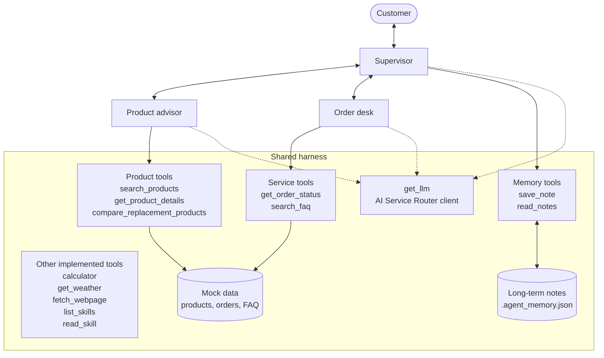
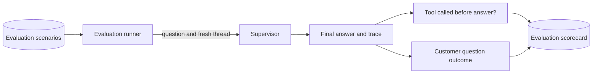
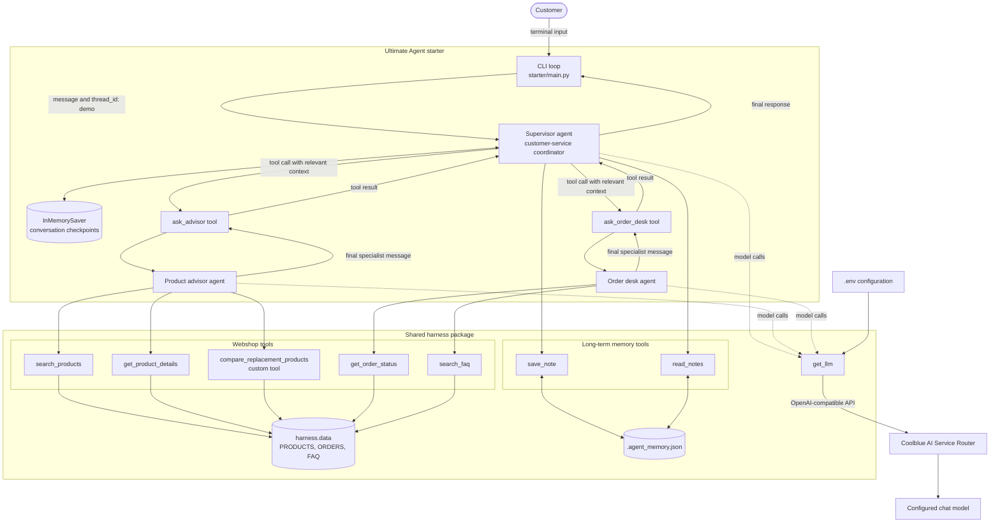
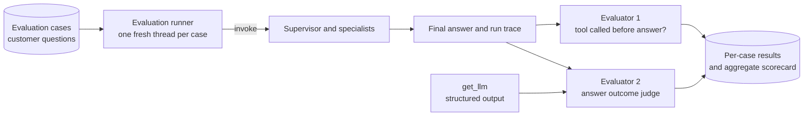

# Current Architecture

The starter implements an **agents-as-tools** architecture. A customer talks to one
supervisor agent through a command-line loop. The supervisor decides whether to
answer directly, use memory, or delegate domain work to one of two specialist
agents. Each specialist is exposed to the supervisor as a normal LangChain tool.

## Architecture at a Glance



## Evaluation at a Glance



## Detailed Architecture



## Replacement Flow

```mermaid
sequenceDiagram
    actor Customer
    participant Supervisor
    participant OrderDesk as Order desk
    participant Advisor as Product advisor
    participant CompareTool as compare_replacement_products

    alt Customer names the broken product
        Customer->>Supervisor: My AEG washing machine is broken; find a replacement
        Supervisor->>Advisor: Find a replacement for the named washing machine
    else Customer refers only to an order
        Customer->>Supervisor: Find a replacement for the product in ORD-1003
        Supervisor->>OrderDesk: Identify the product in ORD-1003
        OrderDesk-->>Supervisor: FreshSpin 8000 Washing Machine
        Supervisor->>Advisor: Find a replacement for FreshSpin 8000 Washing Machine
    end
    Advisor->>CompareTool: Compare the source product with the catalog
    CompareTool-->>Advisor: Similar products from the same category only
    Advisor-->>Supervisor: Grounded replacement recommendation
    Supervisor-->>Customer: Recommended replacement and rationale
```

## Evaluation Architecture

The evaluators run offline around the complete supervisor invocation. They are not
registered as agent tools and cannot influence a live customer conversation.



### Evaluator 1: tool called before the answer

This evaluator should be deterministic; an LLM is unnecessary. It inspects the
ordered supervisor messages or, preferably, the LangSmith run tree and returns:

- `tool_called_before_answer`: `true` when at least one tool invocation starts
    before the final customer-facing assistant message, otherwise `false`.
- `tools_called`: the ordered tool names, such as `ask_order_desk`,
    `get_order_status`, `ask_advisor`, or `compare_replacement_products`.

Calls made by specialist agents count as tool calls. Evaluator/model calls do not.
Using the run tree preserves nested calls that are hidden behind `ask_advisor` and
`ask_order_desk`; inspecting only the final text would not provide reliable proof.
The aggregate metric is the percentage of cases for which
`tool_called_before_answer` is true. If the dataset later contains conversational
messages that should not require a tool, add an `expects_tool_call` field and score
whether actual usage matches that expectation rather than rewarding unnecessary
tool calls.

### Evaluator 2: customer-question outcome

This evaluator uses an LLM judge with structured output. Its inputs are the
original customer question and the final customer-facing answer. It returns exactly
one label and a short rationale:

| Label | Meaning |
| --- | --- |
| `ANSWERED` | The response directly and usefully addresses the customer's question. |
| `NOT_ANSWERED` | The response evades, misunderstands, or leaves the question unresolved without a useful next step. |
| `DIRECTED_TO_CUSTOMER_SERVICE` | Human customer service is presented as the primary next step because the agent cannot complete the request. |

Use this precedence rule to keep labels mutually exclusive: choose
`DIRECTED_TO_CUSTOMER_SERVICE` when escalation is the main resolution; otherwise
choose `ANSWERED` when a substantive answer is present, even if customer service is
mentioned as an optional fallback; choose `NOT_ANSWERED` for all remaining cases.
An honest answer that a product or order cannot be found may still be `ANSWERED`
when it explains the limitation and gives a relevant next step.

The judge should use a typed schema, for example `label`, `rationale`, and
`confidence`, rather than parsing free-form model text. This evaluator measures
answer completion, not factual correctness; grounding or policy compliance would
need separate evaluators.

### Evaluation runner

Implement the offline runner separately from `main.py`:

- `evaluators.py` contains the deterministic trace evaluator, the answer-outcome
    schema, and the LLM judge prompt.
- `evaluate.py` loads the scenarios, invokes the supervisor with a unique
    `thread_id` per case, runs both evaluators, and prints or saves the scorecard.
- An evaluation dataset stores at least `case_id` and `customer_question`; optional
    fields such as `expects_tool_call` and `notes` make results easier to interpret.

The runner should report each case's tool names, Boolean tool result, outcome label,
and judge rationale. Aggregate output should include the tool-call percentage and
counts/percentages for all three outcome labels. Send target runs and judge runs to
separate LangSmith projects or tags so evaluator model calls are never mistaken for
customer-agent tool usage.

## Components

### Command-line interface

`main.py` runs a synchronous read-evaluate-print loop. Every non-empty customer
message is sent to the supervisor with the fixed LangGraph thread ID `demo`. The
last message returned by the supervisor is printed as the CoolShop response.

### Supervisor

The supervisor is a LangChain agent created with `create_agent`. It owns the
customer-facing conversation and can call four tools:

- `ask_advisor` for product discovery and recommendations.
- `ask_order_desk` for orders, delivery, returns, and store policy.
- `save_note` to persist a durable customer fact.
- `read_notes` to retrieve durable facts from earlier conversations.

The supervisor must include all relevant conversation details in a delegation.
Specialists cannot inspect the supervisor's conversation history and receive only
the `request` string supplied in their tool call.

For replacement requests that mention only an order number, the supervisor must
orchestrate two specialists in sequence. It first asks the order desk to identify
the product in the order, then includes that product information when asking the
product advisor for a replacement. It must not ask the advisor to infer or invent
the missing product.

### Specialist agents

The product advisor can call `search_products`, `get_product_details`, and the
custom tool `compare_replacement_products`. Search supports progressive
disclosure by returning compact catalog results before the agent requests complete
specifications for a selected product.

`compare_replacement_products` accepts information about a broken or existing
product and finds the most similar replacements in the CoolShop catalog. It must
first determine the source product's category and return candidates from that same
category only. For example, replacing an AEG washing machine can produce only
washing-machine candidates, ranked by relevant similarity such as capacity,
energy label, dimensions, features, price, and availability. If the source category
cannot be determined, the tool returns no candidates and asks for more product
information rather than searching across categories.

The order desk can call `get_order_status` and `search_faq`. Order lookup returns
mock operational data, while FAQ search retrieves up to two keyword-ranked policy
entries.

Neither specialist has a checkpointer or memory tools. Each invocation starts with
only the delegated request and runs its own model/tool loop until it produces a
final answer. The wrapper returns only that final message to the supervisor.

## Harness Responsibilities

The shared `harness` package supplies infrastructure used by the agents:

- `harness.llm.get_llm` loads the repository `.env`, selects `BOOTCAMP_MODEL`,
  and creates a `ChatOpenAI` client for the Coolblue AI Service Router.
- `harness.tools` exports LangChain tools and themed bundles. The starter imports
    the five webshop tools directly and expands `MEMORY_TOOLS` for the supervisor.
    The comparison tool is included in `WEBSHOP_TOOLS` and attached to the advisor.
- `harness.data` contains the in-process `PRODUCTS`, `ORDERS`, and `FAQ` fixtures
  read by the webshop tools. No external commerce service is called.
- `harness.tools.memory` stores long-term notes in `.agent_memory.json` relative
  to the process's current working directory.

The harness also offers calculator, weather, web, and skill tools, but the current
starter does not attach them to any agent.

## State and Data Lifetime

There are two independent forms of memory:

| State | Owner | Storage | Lifetime |
| --- | --- | --- | --- |
| Conversation messages | Supervisor | `InMemorySaver` checkpoint keyed by `thread_id` | Current Python process |
| Durable customer notes | Supervisor memory tools | `.agent_memory.json` | Across process restarts and conversations |

The product catalog, orders, and FAQ are static Python fixtures. Changes exist only
when the source data is edited; the current tools do not mutate webshop data.

## Current Extension Points

The file intentionally remains starter scaffolding. The order-desk and supervisor
prompts still contain team TODOs. `compare_replacement_products` is implemented and
registered with the product advisor. The two evaluators and evaluation runner
described above are still planned rather than connected. No third specialist is
present. LangSmith tracing can observe LangChain calls when configured through the
environment, but explicit observability setup is not part of `main.py`.